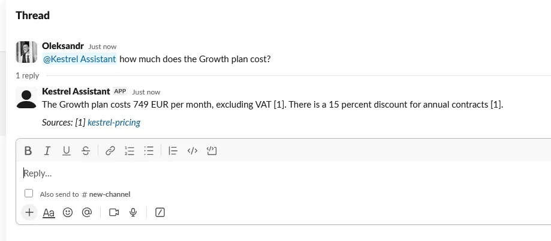
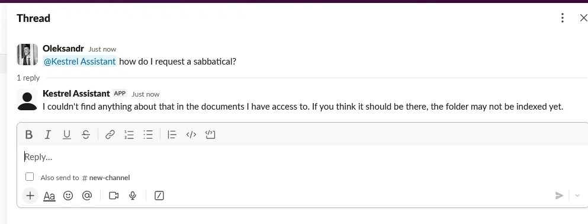
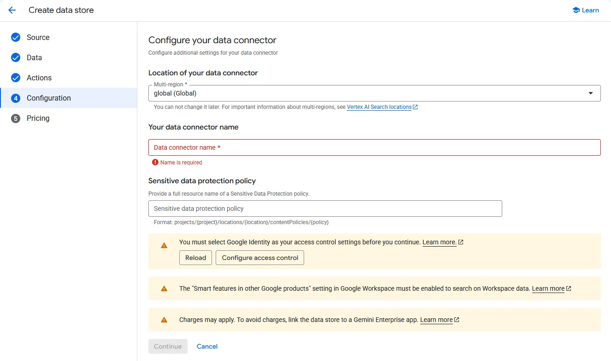

# Grounded Drive Assistant

A question-answering bot over a Google Drive folder that answers **only** from
the documents, cites what it used, and says "I don't know" when it doesn't.

That last part is the whole product. Retrieval is easy. Refusal is hard.

---

## Run it

Retrieval demo needs no API key and no cloud account:

```bash
cd src
python3 cli.py index                 # build the index, print the manifest
python3 cli.py eval --no-llm         # run the test set
python3 cli.py ask "how many vacation days do I get?" --no-llm
```

For generated answers, set `GEMINI_API_KEY` (or `MODEL_PROVIDER=anthropic` +
`ANTHROPIC_API_KEY`) and drop `--no-llm`.

Against a real Drive folder:

```bash
export GOOGLE_APPLICATION_CREDENTIALS=./sa-key.json
python3 drive_ingest.py --folder-id <folder-id> --out ../corpus-drive
python3 cli.py --corpus ../corpus-drive eval --no-llm
```

Retrieval backend is one environment variable:

```bash
RAG_BACKEND=bm25     # keyword. no network, no bill, no latency
RAG_BACKEND=hybrid   # BM25 + Gemini embeddings, rank-fused
RAG_BACKEND=vertex   # Vertex AI Search (Discovery Engine)
```

---

## What it looks like

**Answering, with a citation that links back to the source document:**



**Refusing, because the corpus has nothing on sabbaticals:**



The second screenshot is the product. The first one every RAG demo can do.

---

## The eval set is the point

```
ANSWERABLE   — these must NOT be refused     10/10
UNANSWERABLE — these MUST be refused          6/6
```

Any RAG demo can answer questions. This one is tested on questions it must
*refuse*: crypto payment policy, parental leave, who the CEO is, whether you can
bring a dog to the office. None of that exists in the corpus, so any answer would
be an invention.

A RAG system that quietly guesses is worse than no system, because a wrong answer
delivered confidently — with a citation attached — is harder to catch than no
answer at all.

---

## Seven things that broke

Everything below was hit while building this. Each one is reproducible from this
repository.

### 1. A score threshold is not a grounding gate

The obvious approach: refuse if the retrieval score is below X. It failed in both
directions on the first run.

| Question | Score | What happened |
|---|---|---|
| `what is a KX-Code?` | 1.83 | **Refused** — but the answer was right there in the glossary |
| `what's our policy on crypto payments?` | 9.60 | **Answered** — confidently retrieved the *vacation policy*, because the word "policy" appears in every document |

BM25 scores are not comparable across queries. They scale with query length and
with how rare the chosen words happen to be. Thresholding an incomparable number
is superstition.

**What replaced it: concept coverage.** Take the most distinctive idea in the
question and ask one thing that does have a stable answer:

> does that idea appear, in any of its forms, anywhere in the text we retrieved?

If the user asks about crypto and "crypto" appears nowhere in the corpus, no
similarity score gets to talk us into answering. If they ask about a KX-Code and
it's sitting in the glossary, no low score gets to talk us out of it.

### 2. The new gate then refused things it shouldn't have

First run of the coverage gate: `how many vacation days do I get?` → **refused**.

The word "many" appears nowhere in the corpus, so the gate concluded the corpus
had never heard of the topic. It had. It just doesn't say "many".

Same for `get`. Same for `isn` — which is what `isn't` becomes if you tokenise
carelessly.

**Fix:** contraction handling before tokenisation, a thorough function-word
stoplist, and light stemming so `carry` finds `carried` and `payments` isn't a
different word from `payment`. The stemmer is crude and doesn't need to be
otherwise — it needs to be *consistent*, applied identically at index time and at
query time.

That is the actual work in a RAG system. The pipeline is an afternoon.

### 3. Semantic search cannot say "I don't know"

The most important finding here, and the reason the gate is built the way it is.

Switching on the hybrid backend, the six unanswerable questions scored:

```
15.75  what's our policy on crypto payments?
16.26  how do I request a sabbatical?
16.13  what's the parental leave allowance?
16.13  what's the company's revenue?
16.26  can I bring a dog to the office?
```

Near the top of the range. The embedding model was *confident* about questions the
corpus cannot answer.

This is not a bug. It is what embeddings are: a nearest-neighbour search always
returns a nearest neighbour. There is no vector for "nothing here is relevant".
BM25 is at least honest — no matching words means a low score. Embeddings always
look sure of themselves.

**So the hallucination risk goes UP when you add semantics, not down.**

The gate survives this only because it doesn't ask the index. It asks the
*corpus*: is the word `sabbatical` present in any document at all? No → stop,
before the model is ever called. Grounding is anchored to the documents, not to
whichever retriever happens to be switched on.

If you take one idea from this repository, take that one.

### 4. Scale does not fix hallucination — it hides it

The intuition that more documents means fewer wrong answers is backwards.

- **More plausible noise.** In 8 documents there is obviously nothing about
  sabbaticals. In 800 there is something about leave policy, unpaid absence,
  career breaks — and the nearest neighbour becomes far more convincing. The
  model receives context that is *almost* on topic and starts bridging the gap.
- **The gaps become invisible.** With 8 documents you know what isn't there. With
  800, nobody does — not you, and not the client.

What changes with scale isn't answer quality. It's the cost of being wrong. In a
small corpus a bad answer gets noticed. In a large one, a confident answer with a
citation attached to something adjacent does not.

Refusal is therefore a first-day architectural decision, not a later hardening
step.

### 5. Vertex AI Search's Drive connector requires a Google Workspace organisation

Attempting to create a Drive-connected data store on a personal Google account
dead-ends:



> **Identity provider not configurable.**
> Your project must belong to an organization to configure identity providers.

The chain: the Drive connector mandates ACL enforcement → ACL enforcement
requires Google Identity → Google Identity requires a Workspace organisation.
None of these steps is optional.

So the managed connector — the thing every tutorial reaches for — is unavailable
to anyone without a corporate Workspace. That is worth establishing *before*
promising a client an architecture, not after.

This is also why `drive_ingest.py` exists, and why it stopped being the fallback
and became the primary path.

### 6. The connector asks for far more permission than it uses

The Drive connector's default OAuth consent screen requests, among others:

> View, edit, create and delete all your files in Google Drive.

For a system that only ever reads. Unticking the write scopes and granting only
read — authentication still succeeds. The connector asked for delete permission
it does not need, and the default is *select all*.

`drive_ingest.py` uses `drive.readonly` on a single shared folder.

### 7. In the connector, "just this folder" is config, not permission

The connector lets you restrict indexing to specific folder IDs. But the OAuth
token it holds still has access to the entire Drive — the folder restriction is a
filter in the connector's configuration, not a boundary on the credential.

Change the config, and the restriction is gone. The access was always there.

With a service account shared into one folder, the boundary is on the credential
itself. That is the difference between *does not read* and *cannot read*.

---

## Architecture

```
Drive folder
   │  Drive API — service account, drive.readonly, one shared folder
   ▼
Docs   → Markdown (native export)
Sheets → Markdown tables (structure preserved: a number
         without its column header is worthless to retrieval)
PDF    → Markdown (PyMuPDF, reading-order blocks)
   │
   ▼
corpus/*.md  +  manifest.json
   │
   ▼
chunk on headings — not a sliding window. Headings give stable
                    citation anchors and match how policy documents
                    are actually written.
   │
   ▼
Retriever  (RAG_BACKEND)
   ├── bm25     keyword + hand-maintained term dictionary
   ├── hybrid   BM25 + Gemini embeddings, fused on RANK not score
   └── vertex   Vertex AI Search (Discovery Engine)
   │
   ▼
Gate 1: concept coverage  ← deterministic, corpus-anchored, refuses
                            before a single token is spent
Gate 2: grounded prompt   ← cites sources, returns NO_ANSWER when
                            the retrieved text does not contain the answer
   │
   ▼
Answer + citations → link back to the source document
```

### Why RRF and not a weighted sum

BM25 scores and cosine similarities are different currencies — one is unbounded
and query-dependent, the other is bounded to [-1, 1]. Adding them together
produces a number, but not a meaning.

Reciprocal Rank Fusion only asks each retriever *how highly did you rank this*,
which is a question both can answer honestly.

### Why the manifest exists

Every source file gets a row: id, revision, content hash, chunk count, and any
error. Reconciliation becomes a set comparison, so a missing document is a loud,
specific failure rather than a vague sense that the bot has got worse.

The manifest also tracks an `empty` list: documents that parsed without error and
produced zero chunks. That is the signature of a scanned PDF — present in every
summary, containing nothing. Present-but-empty is worse than failed, because
failure at least announces itself.

An index you cannot audit is an index you cannot trust.

### Why the retriever sits behind an interface

One environment variable swaps the backend. Nothing above the interface knows or
cares.

That is what makes it possible to move between a self-hosted index and a managed
one — in either direction — without rewriting the application. A client should not
have to choose between "the right default" and "not locked in".

---

## Interface: Slack first, not Slack only

People don't visit a separate website to ask a question. They ask where they
already are.

A standalone web chat gets used in week one, forgotten by week three, and quietly
cancelled at renewal. Put the assistant where the work already happens and it
costs nothing to reach. So Slack is the default here — not the limit.

The core knows nothing about Slack. `retrieval.py`, `answering.py`, `chunking.py`
and `manifest.py` contain no transport code at all, and they are already driven by
two independent front ends in this repository:

```
        corpus → retrieval → gate → answering + citations
                     ▲                    ▲
            ┌────────┴─────────┬──────────┘
         cli.py          slack_bot.py        ← and an HTTP API here
```

That is why a third front end is an adapter, not a rewrite. A React/Next.js chat
with token streaming and clickable citations is a thin layer over the same call
the CLI already makes — worth building when the users live in a web product, or
sit outside the workspace entirely; not worth building *first*, when they don't.

The interface is a deployment decision. The grounding is an architectural one.
Only one of them is expensive to get wrong.

---

## Security

- Read-only Drive scope, scoped to one shared folder. No broader Drive access.
- Documents are not used for training. They enter a prompt for the duration of one
  request and are gone.
- Query logs kept separate from document content.
- No document text is written anywhere except the corpus directory and the index.

---

## Known limits

An honest list, because a demo that hides its edges is a sales pitch.

- **Scanned PDFs need OCR.** Not wired up. The manifest flags them as empty rather
  than pretending they are fine.
- **The term dictionary is hand-maintained.** In production it grows every time the
  bot gets a question wrong — the cheapest possible feedback loop, but a loop, not
  a solve. The hybrid backend reduces the dependence on it; it does not remove it.
- **RRF scores are not diagnostic.** Any chunk ranked first by both retrievers gets
  the same fused score, so the number in the logs stops being informative. Real,
  and cosmetic.
- **No incremental sync yet.** `drive_ingest.py` re-reads the whole folder. The
  manifest already carries revision and content hash, so skipping unchanged files
  is a small change — it just isn't done.
- **The corpus here is fictional.** Kestrel Labs does not exist. The gaps in it are
  deliberate: they are what makes the refusal tests meaningful.
